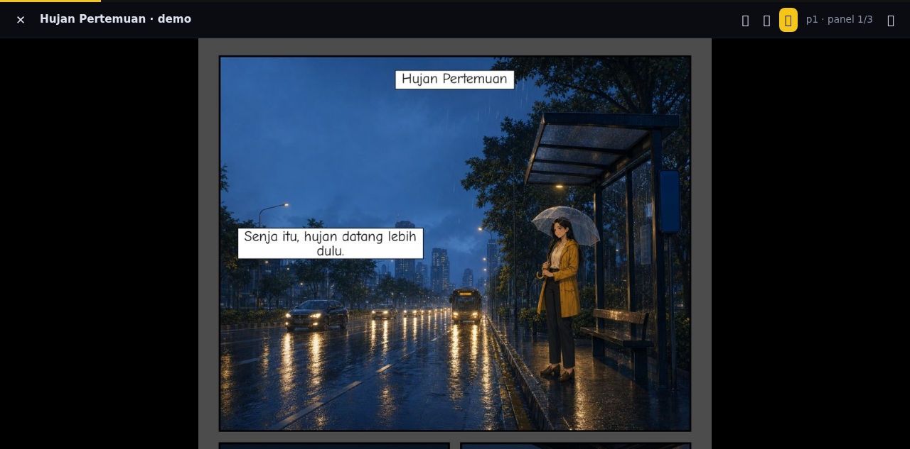

# PanelView 🎬

**A cinematic comic reader that runs entirely in your browser.**

Drop in a `.cbz`, an image folder, or a [Comic Sol](https://github.com/wenn-id/comic-sol) project — and read it in three modes, including a Marvel-style **Guided View** where the camera glides from panel to panel.

**▶ [Live demo](https://wenn-id.github.io/panelview/)** — click *Try the demo comic*, then press `3`.



## Why

Most web comic readers show you pages. PanelView shows you *panels* — with cinematic zoom-and-pan transitions, the way motion comics and official reader apps do it.

- **Comic Sol projects**: panel geometry is read straight from the project manifest, so guided framing is **pixel-exact** — no guessing.
- **Any CBZ / image folder**: automatic panel detection (gutter analysis on a canvas) with graceful fallback to full-page framing.

## Features

- 📖 **Page mode** — classic single page, keyboard / swipe / click zones
- 📜 **Webtoon mode** — smooth vertical scroll
- 🎬 **Guided mode** — panel-by-panel cinematic camera with dimmed surroundings
- 🔒 **100% client-side** — no upload, no server, no tracking. Your files never leave your machine
- 📦 **Zero dependencies, zero build** — one HTML + one JS + one CSS; the ZIP reader is ~60 lines using the native `DecompressionStream`
- 💾 Resume where you left off (localStorage)
- 📱 Works on mobile (swipe, responsive UI)

## Usage

Open the [live demo](https://wenn-id.github.io/panelview/) or serve the folder locally:

```bash
git clone https://github.com/wenn-id/panelview
cd panelview
python3 -m http.server 8080   # any static server works
```

Then drop in:

| Input | What happens |
|---|---|
| `.cbz` / `.zip` | Unzipped in-browser (stored + deflate), pages natural-sorted |
| Image folder | Natural-sorted pages |
| Comic Sol project folder | `project.json` + `plan/storyboard.json` detected → exact panel rects |

**Keys:** `←`/`→`/`space` navigate · `1`/`2`/`3` switch mode · `f` fullscreen · `Esc` close

## Comic Sol integration

[Comic Sol](https://github.com/wenn-id/comic-sol) is an agent skill that turns a story prompt into a finished comic. Its storyboards carry the exact pixel rect of every panel (`plan/storyboard.json` → `pages[].panels[].rect`), and PanelView reads those rects directly, so any Comic Sol output folder becomes a cinematic guided-view experience with zero configuration. For manifests without rects, a JS port of Comic Sol's layout math (`layout_rects`) acts as fallback geometry.

**Tested schema:** `project.json` `schema_version` `"1.0"`. Missing versions are treated as legacy; untested future versions still render, with a non-blocking notice that framing may be off. See the [viewer contract](docs/viewer-contract.md) for the consumed manifest fields and compatibility matrix. Titles fall back to a prettified `project_id`, and the story-plan `logline` shows as a toolbar subtitle when present.

## Tests

Open `test.html` in a browser (or via the static server). Assert-based checks for the ZIP parser, layout geometry parity, natural sort, and book detection — no framework.

The zero-build CI runner uses system Chrome and Node's built-in CDP client:

```bash
node tools/run-tests.mjs test.html tools/parity.html
```

`tools/fetch-fixture.mjs` refreshes or verifies the pinned Comic Sol manifest fixture. CI runs `--check` so upstream changes cannot silently move parity expectations. Failed browser pages write PNGs to `shots/`; GitHub Actions uploads them as `failure-screenshots`.

GitHub Pages deploys from `main` after the browser and parity gates pass. The live URL is the [demo](https://wenn-id.github.io/panelview/).

## Roadmap

- CBR (RAR) support
- PDF input
- Panel-order editor for correcting auto-detection
- Reading-direction (RTL / manga) toggle

## License

MIT
